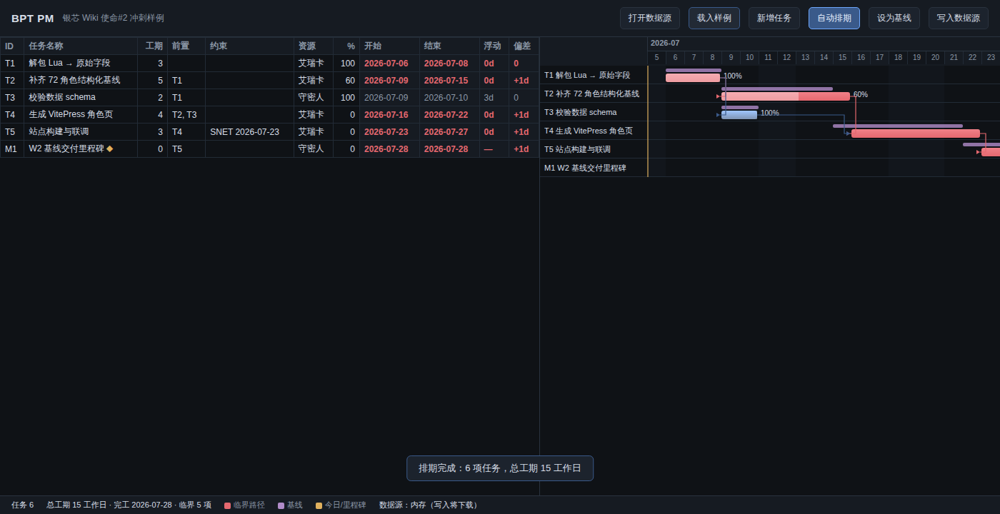

# BPT PM — 项目排期工作台

一个**零依赖、零后端、离线可用**的单网页项目管理排期工具。约定一份 JSON 数据协议描述
项目任务，浏览器本地读取后做**类微软 Project 的关键路径自动排期（CPM）**与**基线比对**，
确认后写回同一数据源。

## 快速开始

直接用浏览器打开 [`index.html`](./index.html)（双击文件即可，无需服务器）：

1. 点 **载入样例** —— 立即看到 6 任务的排期、临界路径与基线对照甘特图。
2. 点 **打开数据源** —— 选本地 `*.json`（Chrome / Edge 支持直接**写回同一文件**；
   其他浏览器回退为拖放载入 + 下载保存）。
3. 表格里原地编辑任意字段 → 点 **自动排期** → 得到开始/结束日、总浮动、临界路径与甘特图。
4. 点 **设为基线** 捕获当前排期为基准；之后调整再排期，**偏差**列即显示相对基线的漂移。
5. 点 **写入数据源** 落盘。



## 数据协议 `bpt-pm/v1`

一份 JSON = 一个项目。完整定义见 [`schema/task-schema.json`](./schema/task-schema.json)，
样例见 [`data/sample-project.json`](./data/sample-project.json)。核心字段：

```jsonc
{
  "protocol": "bpt-pm/v1",
  "project": {
    "name": "项目名",
    "start": "2026-07-06",                       // 锚点日期
    "calendar": { "workdays": [1,2,3,4,5], "holidays": ["2026-07-20"] }
  },
  "tasks": [
    {
      "id": "T2", "name": "任务", "duration": 5,   // 工期=工作日；0=里程碑
      "predecessors": [{ "id": "T1", "type": "FS", "lag": 0 }],  // FS/SS/FF/SF + 延时
      "constraint": { "type": "SNET", "date": "2026-07-23" },    // ASAP/SNET/MSO
      "resource": "艾瑞卡", "percentComplete": 60
    }
  ],
  "baseline": null                               // 或 { capturedAt, tasks:{id:{start,finish}} }
}
```

## 能力

- **自动排期（CPM）**：前向/后向计算，支持 4 种依赖类型（FS/SS/FF/SF）+ 延时/提前量、
  工作日历（跳过周末与节假日）、SNET/MSO 约束。
- **临界路径**：自动识别并高亮（表格红字 + 甘特红条 + 红色依赖连线）；总浮动逐任务显示。
- **基线比对**：一键捕获基线快照，甘特图叠加基线条，表格显示每任务的结束日偏差（工作日）。
- **资源冲突可视化（v2）**：`resources` 注册表（人=产能1 / 外包=并发产能N），「切到资源负载」
  切出资源×日热力图——超载标红、满载标绿（外包并发吸收）、行标产能与超载红点，状态栏汇总超载资源。
- **版本周期守护（v2-B）**：任务级可选 `deadline` 软截止线（不移动任务）；排期后标注每任务是否误期
  与误期工作日数（`late`/`lateDays`），顶层汇总 `lateCount`——一眼看出哪些任务越过了该交的红线。
- **流水线模板 + 返修回环（v2-C）**：项目级 `templates` 一键把「概念→终审→建模→接入」等标准工序
  展开成 FS 链接任务串，含 R 轮「审核→返修」回环，供批量铺角色/资产的排期骨架。
- **外包发单对象（v2-D）**：项目级 `orders` 把发单建为一等对象（供应商/PO/预计交付/返修轮次/状态流水），
  关联排期任务后自动标交付风险（`atRisk`：排期结束晚于预计交付），顶层汇总 `ordersAtRisk`。
- **引擎完备性（v3-①）**：自由浮动 `freeSlack`（不连累后继的可拖天数）；约束补齐 8 型（新增 ALAP/SNLT/FNET/FNLT/MFO）；
  **从完成日倒排** `project.scheduleFrom="finish"`（定死交付日反推每步最晚开工）。
- **资源错峰建议（v3-②）**：`suggestLeveling` 贪心串行把撞车任务串到不超产能，只出建议不改排期（可再应用）；「错峰建议」视图。
- **WBS 层级摘要（v3-③）**：`task.parent` 构成层级，摘要任务自动卷积子任务起止（不参与 CPM/资源），支持嵌套。
- **冲突显式告警（v3-④）**：`warnings` 面板列出约束冲突/负浮动/倒排窗口不足，命中任务行插红旗。
- **甘特图**：月/日时间轴、进度条、里程碑◆、依赖箭头、今日线、周末底纹。
- **读写数据源**：File System Access API 直接读写本地文件；不支持时回退拖放 + 下载。
- **依赖健壮性**：环依赖与悬空引用在排期时报警告，不静默。

## 前置依赖迷你语法

表格「前置」列填：`T1`（默认 FS+0）、`T2SS+2`、`T3FF-1`、`T4SF`，多个用逗号分隔。
「约束」列填 `SNET 2026-07-23` 或 `MSO 2026-07-10`，留空即 ASAP（尽早开始）。

## 设计取舍

- **单文件自包含**：引擎、样式、样例数据全部内嵌 `index.html`，可离线双击运行、可随手分发。
- **工作日索引空间**：排期在整数工作日索引上算，再映射回日历日期，天然处理周末/节假日。
- **写回优先原数据源**：用 File System Access API 打开的文件可原地写回，形成「读→排→写」闭环。
